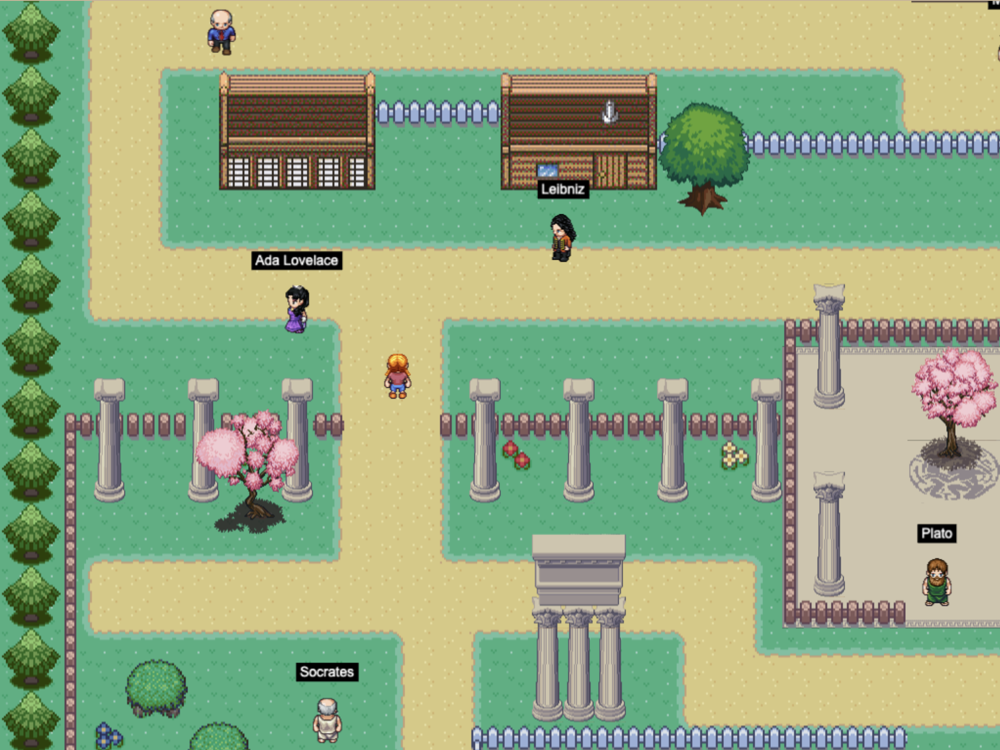

# Mtserlebi Agents 🎭

An interactive philosophical AI agent system that brings famous philosophers and thinkers to life in an engaging game environment. Explore a pixel-art town, interact with historical figures, and engage in deep philosophical discussions powered by advanced LLM technology.



## 📋 Overview

Mtserlebi Agents is a full-stack application that combines:

- **Backend API** (`mtserlebi-api`): A Python-based conversational AI system built with FastAPI and LangGraph, featuring sophisticated multi-agent workflows and long-term memory capabilities
- **Frontend UI** (`mtserlebi-ui`): An interactive Phaser 3 game where players can explore a town and engage with philosophical characters

The system leverages modern AI technologies including LLMs (via Groq), vector embeddings, RAG (Retrieval-Augmented Generation), and persistent conversation memory to create authentic philosophical dialogues.

## ✨ Features

### Interactive Game Environment
- **Pixel-art town exploration**: Navigate through a charming Pokemon-style world
- **Dynamic NPCs**: Philosophers and thinkers roam the town with realistic movement patterns
- **Collision detection**: Realistic physics and interactions
- **Beautiful assets**: Built with Tuxemon and LPC (Liberated Pixel Cup) assets

### Philosophical Characters
Interact with famous thinkers including:
- **Ancient Philosophers**: Socrates, Aristotle, Plato
- **Modern Philosophers**: Descartes, Leibniz, Dennett, Searle
- **AI Pioneers**: Alan Turing, Noam Chomsky
- **And more**: Ada Lovelace, Sophia (representing modern AI)

Each character has their own:
- Unique conversational style based on their works and ideas
- Long-term memory of past conversations
- Knowledge base sourced from their philosophical writings

### Advanced AI Architecture
- **LangGraph Workflows**: Sophisticated multi-agent conversation flows
- **Long-term Memory**: Persistent conversation history using MongoDB
- **RAG System**: Context-aware responses using vector embeddings
- **Context Summarization**: Automatic conversation summarization for efficiency
- **Evaluation Framework**: Built-in tools for testing and improving agent responses

## 🛠️ Technology Stack

### Backend
- **Framework**: FastAPI
- **AI/ML**: LangChain, LangGraph, LangChain-Groq
- **LLM**: Groq API (Llama 3.3 70B, Llama 3.1 8B)
- **Embeddings**: HuggingFace Sentence Transformers
- **Database**: MongoDB (conversation state, checkpoints, long-term memory)
- **Observability**: Opik/Comet ML
- **Language**: Python 3.11+

### Frontend
- **Game Engine**: Phaser 3
- **Build Tool**: Webpack 5
- **Language**: JavaScript (ES6+)
- **Module Bundler**: Babel

## 📦 Prerequisites

Before you begin, ensure you have the following installed:

- **Python**: 3.11 or higher
- **Node.js**: 14.x or higher
- **MongoDB**: Running instance (local or cloud)
- **Groq API Key**: Sign up at [Groq](https://groq.com)
- **OpenAI API Key**: Required for evaluation features

Optional but recommended:
- **Docker**: For containerized deployment
- **Docker Compose**: For running the full stack

## 🚀 Installation

### Option 1: Docker Compose (Recommended)

The easiest way to run the entire stack:

```bash
# Clone the repository
git clone https://github.com/gduchidze/mtserlebi-agents.git
cd mtserlebi-agents

# Set up environment variables
cp mtserlebi-api/.env.example mtserlebi-api/.env
# Edit .env file with your API keys

# Start all services
docker-compose up -d
```

The UI will be available at `http://localhost:8080`

### Option 2: Manual Installation

#### Backend Setup

```bash
cd mtserlebi-api

# Create virtual environment (using uv or venv)
uv venv
source .venv/bin/activate  # On Windows: .venv\Scripts\activate

# Install dependencies
uv pip install -e ".[dev]"

# Set up environment variables
cp .env.example .env
# Edit .env file with your configuration

# Run the API server
uvicorn philoagents.application.main:app --reload
```

#### Frontend Setup

```bash
cd mtserlebi-ui

# Install dependencies
npm install

# Start development server
npm run dev
```

The game will be available at `http://localhost:8080`

## 🎮 Usage

### Playing the Game

1. **Movement**: Use arrow keys to move your character around the town
2. **Interaction**: Press `Space` when near a philosopher to start a conversation
3. **Dialogue**: Engage in philosophical discussions through the dialogue system
4. **Exit**: Press `ESC` to close dialogue windows or open the pause menu

### API Endpoints

The backend API provides endpoints for:
- Conversing with philosophers
- Managing conversation state
- Retrieving conversation history
- Evaluating agent responses

See `mtserlebi-api/README.md` for detailed API documentation.

## 📁 Project Structure

```
mtserlebi-agents/
├── mtserlebi-api/          # Backend API
│   ├── src/
│   │   └── philoagents/
│   │       ├── application/    # Application layer (services, workflows)
│   │       ├── domain/        # Domain models
│   │       ├── infrastructure/ # Infrastructure (DB, external services)
│   │       └── config.py      # Configuration management
│   ├── data/              # Knowledge base and data files
│   ├── notebooks/         # Jupyter notebooks for experimentation
│   ├── pyproject.toml     # Python dependencies
│   └── Makefile           # Development commands
│
├── mtserlebi-ui/          # Frontend Game
│   ├── src/
│   │   ├── main.js        # Entry point
│   │   ├── scenes/        # Phaser scenes
│   │   ├── classes/       # Game classes
│   │   └── services/      # API services
│   ├── public/
│   │   └── assets/        # Game assets (sprites, maps, etc.)
│   ├── package.json       # Node dependencies
│   └── webpack/           # Webpack configuration
│
├── docker-compose.yml     # Docker Compose configuration
└── README.md             # This file
```

## 🔧 Development

### Backend Development

```bash
cd mtserlebi-api

# Format code
make format-check
make format-fix

# Lint code
make lint-check
make lint-fix

# Run tests
make test
```

### Frontend Development

```bash
cd mtserlebi-ui

# Development server (with logging)
npm run dev

# Development server (without analytics)
npm run dev-nolog

# Production build
npm run build
```

## 🧪 Testing

Run the test suite for the backend:

```bash
cd mtserlebi-api
make test
```

For frontend testing, see `mtserlebi-ui/README.md`

## 📚 Documentation

- **API Documentation**: See [mtserlebi-api/README.md](mtserlebi-api/README.md)
- **UI Documentation**: See [mtserlebi-ui/README.md](mtserlebi-ui/README.md)

## 🤝 Contributing

Contributions are welcome! Please feel free to submit a Pull Request. For major changes:

1. Fork the repository
2. Create your feature branch (`git checkout -b feature/AmazingFeature`)
3. Make your changes
4. Run tests and linting
5. Commit your changes (`git commit -m 'Add some AmazingFeature'`)
6. Push to the branch (`git push origin feature/AmazingFeature`)
7. Open a Pull Request

## 📄 License

This project is licensed under the MIT License - see the [LICENSE](mtserlebi-ui/LICENSE) file for details.

## 🙏 Acknowledgments

- **Phaser 3**: Amazing HTML5 game framework
- **LangChain & LangGraph**: Powerful tools for building AI agents
- **Groq**: Fast LLM inference
- **Asset Credits**:
  - [Tuxemon](https://github.com/Tuxemon/Tuxemon)
  - [LPC Plant Repack](https://opengameart.org/content/lpc-plant-repack)
  - [LPC Compatible Ancient Greek Architecture](https://opengameart.org/content/lpc-compatible-ancient-greek-architecture)
  - [Universal LPC Spritesheet Generator](https://liberatedpixelcup.github.io/Universal-LPC-Spritesheet-Character-Generator/)

## 📞 Support

For questions, issues, or feature requests, please [open an issue](https://github.com/gduchidze/mtserlebi-agents/issues) on GitHub.

---

Built with ❤️ by the Mtserlebi Agents team
